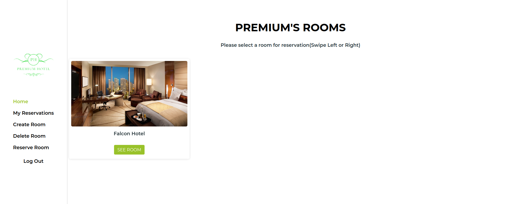

# Book an Appointment Frontend

> Book an Appointment frontend is the frontend of the Book an Appointment app. The theme of the app is Hotels. The app allows a user to do the following:
  - Login/Sign up.
  - Add Hotels to a list of hotels available for reservation.
  - Reserve selected Hotel.
  - Delete selected hotels.

## Built With

- Html, CSS, Javascript
- React, Redux, Thunk
- Webpack, Jest, Gitflow

## Live Demo

[Live Demo Link](https://illustrious-manatee-a1d62c.netlify.app/)

## Getting Started

To get a local copy up and running in your machine:

    1.Clone this repo or download the zip folder:

      git clone https://github.com/Lockless404/dotaCapstone.git

    2.Navigate to the location of the folder in your machine:

      you@your-Pc-name:~$ cd <folder>

    3.Install all the dependencies:

      npm install

    4.Run app in your local browser:

      npm start

## KanBan Board

### KanBan Board Link

[KanBan Board Link](https://github.com/kingqabil/book-an-appointment-backend/projects/1)

### Initial state

### Final number of numbers
 `3`

## Authors

👤 **SadiQ HabiL**

- GitHub: [@kingqabil](https://github.com/kingqabil)
- Twitter: [@kingqabil](https://twitter.com/kingqabil)
- LinkedIn: [@kingqabil](https://linkedin.com/in/kingqabil)

👤 **Bertrand Mutangana Ishimwe**

- GitHub: [@BertrandConxy](https://github.com/BertrandConxy)
- Twitter: [@Bconxy](https://twitter.com/BertrandMutanga)
- LinkedIn: [Bertrand Mutangana Ishimwe](https://www.linkedin.com/in/bertrandmutangana)

👤 **Hamza Tarar**

- GitHub: [@Lockless404](https://github.com/Lockless404)
- Twitter: [@hamza_tarar10](https://twitter.com/hamza_tarar10)
- LinkedIn: [Hamza Tarar](https://www.linkedin.com/in/hamzaalitarar/)

## 🤝 Contributing

Contributions, issues, and feature requests are welcome!

Feel free to check the [issues page](../../issues/).

## Show your support

Give a ⭐️ if you like this project!

## Acknowledgments

- Original design idea by Gregoire Vella on Behance.
- The Creative Commons license of the design credit to the author.

## 📝 License

This project is [MIT](./MIT.md) licensed.
